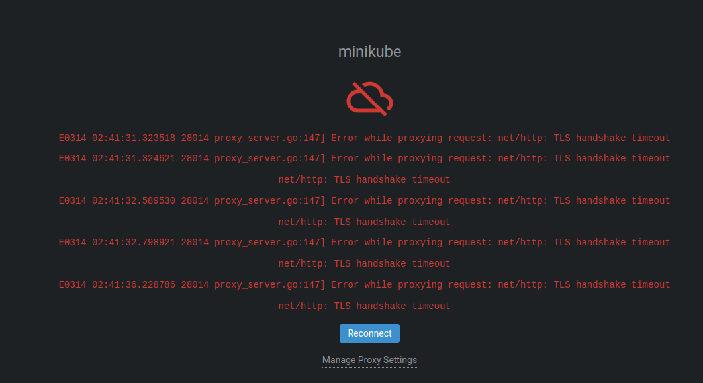
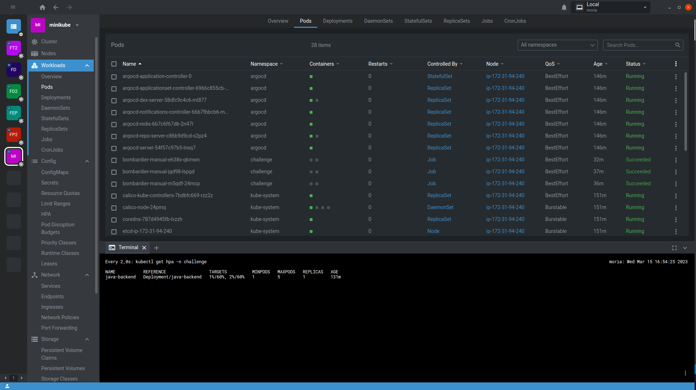
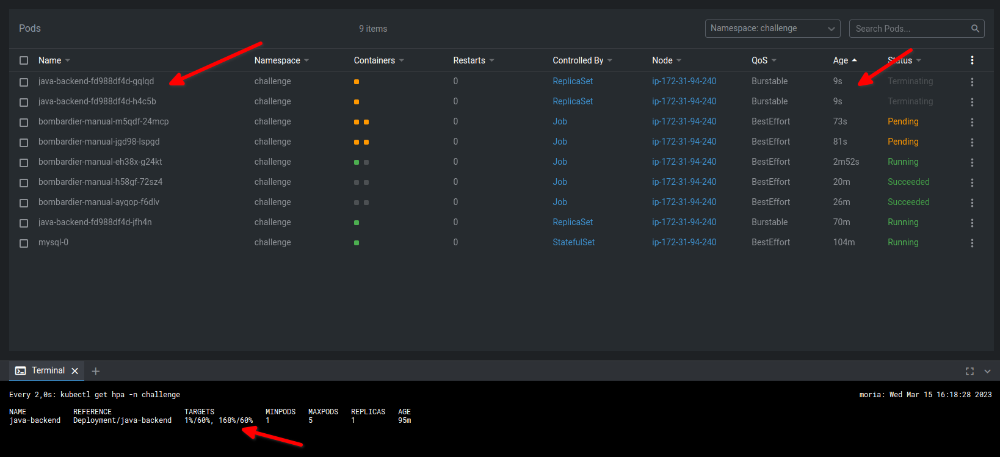

# DevOps Challenge - Base

## tarefas do Challenge

- [x] Instale o Minikube e o Kubernetes no Ubuntu.
- [x] Crie um cluster Kubernetes no Minikube.
- [X] Crie um deployment do MySQL no cluster Kubernetes.
- [X] Crie um serviço para o deployment do MySQL, para que a aplicação possa se conectar a ele.
- [X] Crie um deployment da aplicação Java no cluster Kubernetes.
- [X] Exponha a aplicação através de um serviço do tipo NodePort, para que ela possa ser acessada a partir do host.
- [X] Adicione um health check à aplicação, para garantir que ela esteja funcionando corretamente.
- [X] Configure a aplicação para permitir a alteração da versão da imagem sem downtime.
- [X] Execute um stress test na aplicação para validar sua capacidade de lidar com cargas de trabalho pesadas.
- [X] Configure a aplicação para fazer o scaling horizontal com base na utilização de recursos.

## TODO

- [X] criar ambiente
  - [x] minikube local
  - [X] instalar argocd
  - [X] terraform para deploy de ec2 com minikube
- [X] subir o MySQL
  - [x] criar Application
- [X] subir aplicação Java
  - [ ] código da aplicação
  - [ ] pipeline para build da imagem
  - [ ] dockerfile
  - [X] criar manifestos K8s

## Roteiro

### Repositórios

criei 2 repositórios:

<https://github.com/brunoarruda/devops-challenge-terraform>, para versionar a criação dos recursos na AWS
<https://github.com/brunoarruda/devops-challenge-base-deployment>, para versionar o deployment dentro do cluster

Eu iniciei um terceiro repositório que conteria uma aplicação java que escutaria requisições HTTP e consumiria recursos, para simular algum tipo de atividade real, e aproximar um pouco mais o cenário ao que foi solicitado, entretanto não houve tempo hábil para prosseguir, então eu decidi um nginx para demonstrar a funcionalidade de escabilidade dentro do cluster usando HPA.

### Terraform

criei o módulo para EC2 me baseando no módulo da comunidade [terraform-aws-modules/ec2-instance/aws"](https://registry.terraform.io/modules/terraform-aws-modules/ec2-instance/aws/4.3.0?utm_content=documentLink&utm_medium=Visual+Studio+Code&utm_source=terraform-ls)

No mesmo repositório, eu criei uma pasta `infrastructure` para guardar as configurações dos recursos a serem criados na AWS. Dentro da pasta há uma hierarquia para organizar o código, da seguinte maneira:

```text
├── infrastructure
│   └── lab # conta ou ambiente do recurso
│       └── ec2 # tipo de recurso
│           └── challenge # projeto
│               └── <arquivos terraform para deployment>
├── module
    └── ec2 # tipo do módulo
        └── <arquivos de definição do módulo>
```

Houve 2 recursos que precisei criar manualmente para poder executar meu código terraform:

- a chave ssh para conectar na EC2. Apesar de existir um recurso aws_key_pair, ele só faz gestão de uma chave existente, não gera uma nova.
- o s3 onde o tfstate ficou salvo


```shell
tf plan -var-file=./variables.tfvars
```

Pelo terraform, já é instalado o minikube, ArgoCD e Nginx Ingress. Caso fosse necessário obter alguma informação sobre a execução dos comandos no script `user_data`, isso seria possível de recuperar consultando os logs em `/var/log/syslog`, na EC2.

### Minikube

O minikube foi instalado com sucesso na EC2 usando a propriedade `user_data`, entretanto não foi possível conectar no minikube a partir da minha máquina. Devido aos problemas, eu alternei algumas estratégias, primeiro tentei usar o [podman](https://minikube.sigs.k8s.io/docs/drivers/podman/) como driver para o cluster kubernetes, após falhas eu tentei o [Docker](https://minikube.sigs.k8s.io/docs/drivers/docker/) e após mais falhas, decidi não usar [nenhum drive](https://minikube.sigs.k8s.io/docs/drivers/none/), fazendo a instalação baremetal.



Não é suficiente instalar o docker e o minikube para a instalação funcionar corretamente no Ubuntu 20.04. Foi necessário tomar as seguintes medidas para conseguir configurar o k8s modificações necessárias na máquina para fazer o minikube funcionar:

- desativação do AppArmor
- instalação do conntrack, crictl, cri-dockerd

### Lens

para configurar o acesso ao Lens, eu copio o kubeconfig da instância ec2 para meu computador local com scp:

```shell
scp -i ~/.ssh/minikube-challenge.pem ubuntu@<ec2 public ip>:/home/ubuntu/.kube/config ~/.kube/minikube-ec2
```

Com o kubeconfig, configurei o acesso ao cluster via lens e kubectl



### HPA

Para o HPA funcionar no minikube, é necessário ativar o addon do metrics-server, que é um [requisito](https://kubernetes.io/docs/tasks/run-application/horizontal-pod-autoscale/#support-for-metrics-apis) para o funcionamento do HPA

Após essa configuração, o HPA funcionou, escalando a aplicação quando ela tinha alta demanda.



## Considerações

Por se tratar de um ambiente de demonstração e devido à falta de tempo, foram feitas grandes simplificações:

1. Não há cuidados na parte de segurança quanto à criação e gestão de secrets, que estão salvas em código. Isso pode ser resolvido por um serviço de gerenciamento de secrets (Hashicorp Vault ou AWS Secrets Manager) ou pela criptografia dos dados sensíveis usando SOPS
2. O ArgoCD instala a aplicação lendo manifestos kubernetes diretamente. Em um ambiente que use ArgoCD para várias aplicações, seria mais interessante criar um template em Helm para permitir a reusabilidade e facilitar a manutenção de templates
3. Eu realizei o setup do ArgoCD via userData no EC2, mas um jeito mais robusto de resolver isso é usando um módulo de Helm no terraform, entretanto o módulo supõe a existência do cluster como um EKS, e não como uma instância on-premise em uma EC2.
